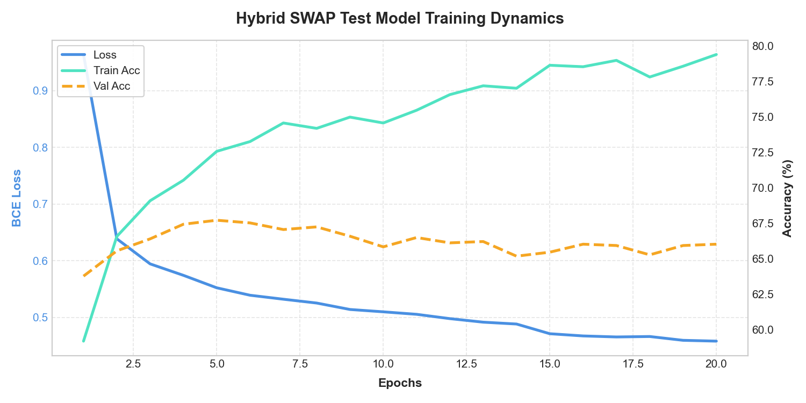
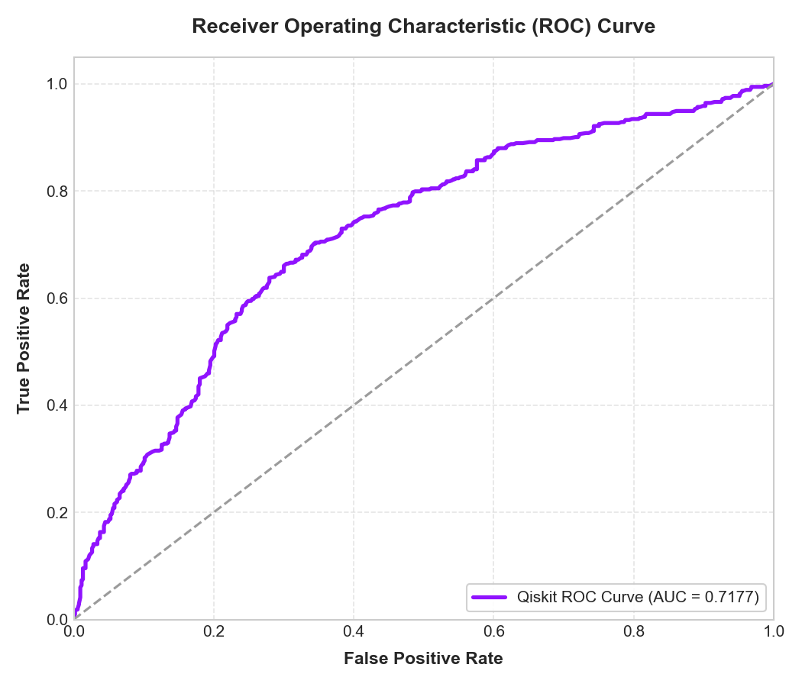
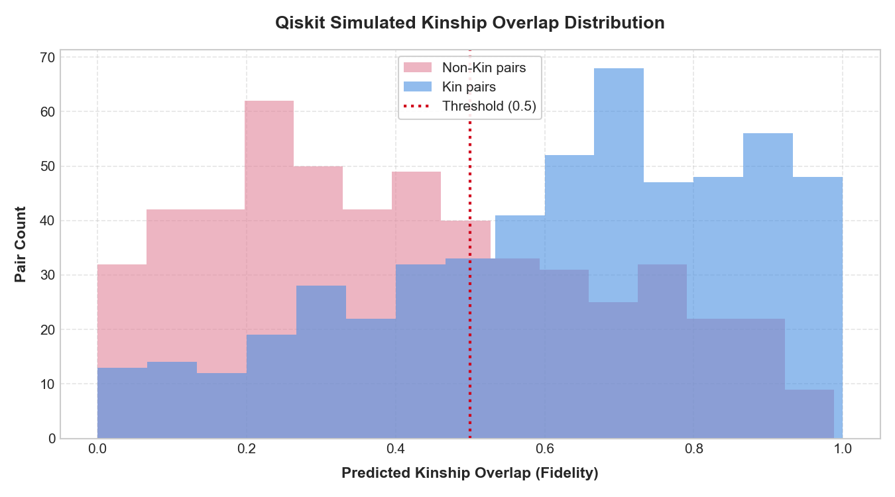
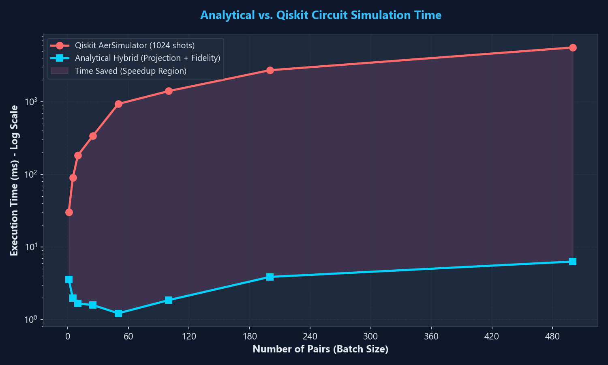
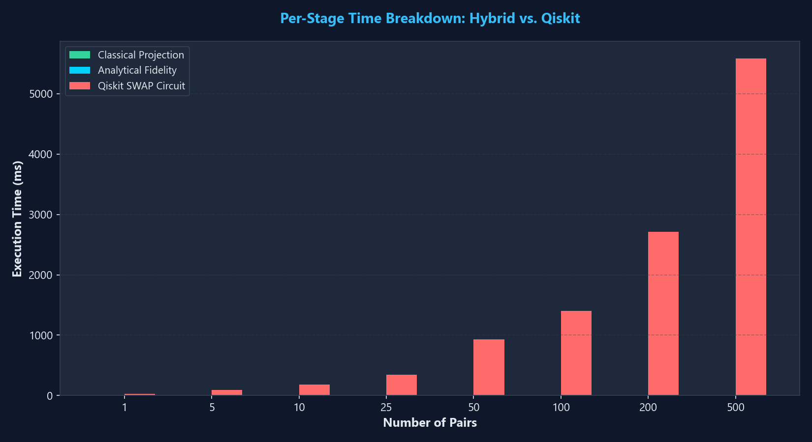
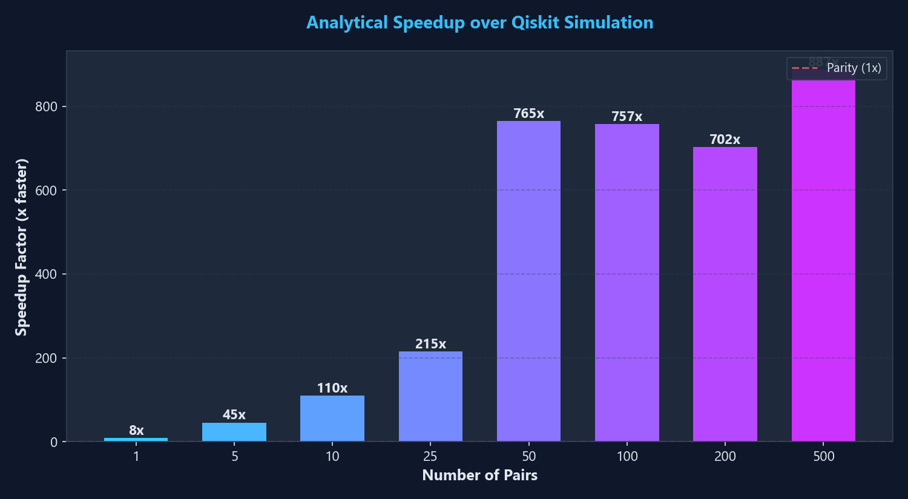
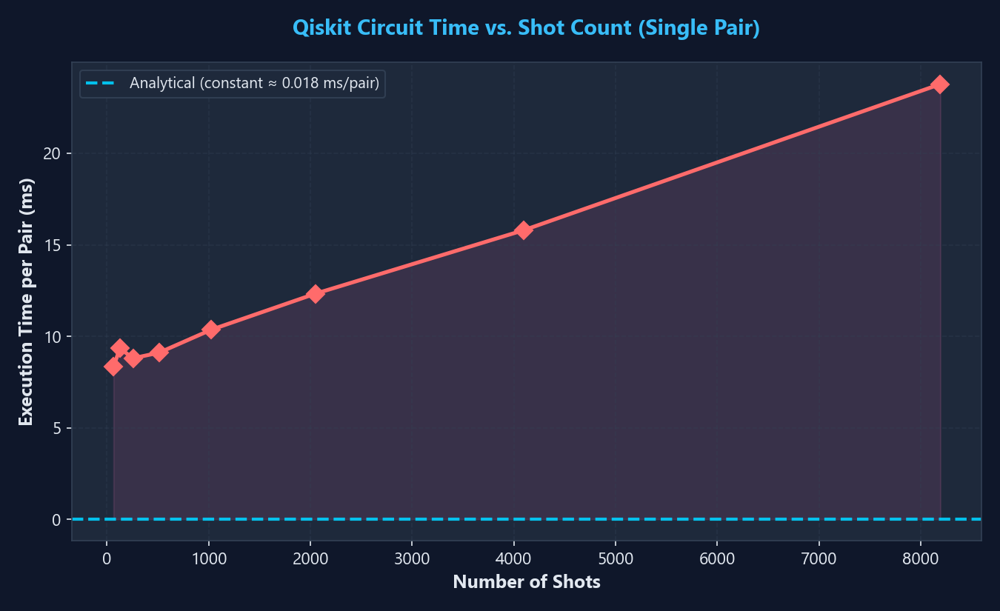
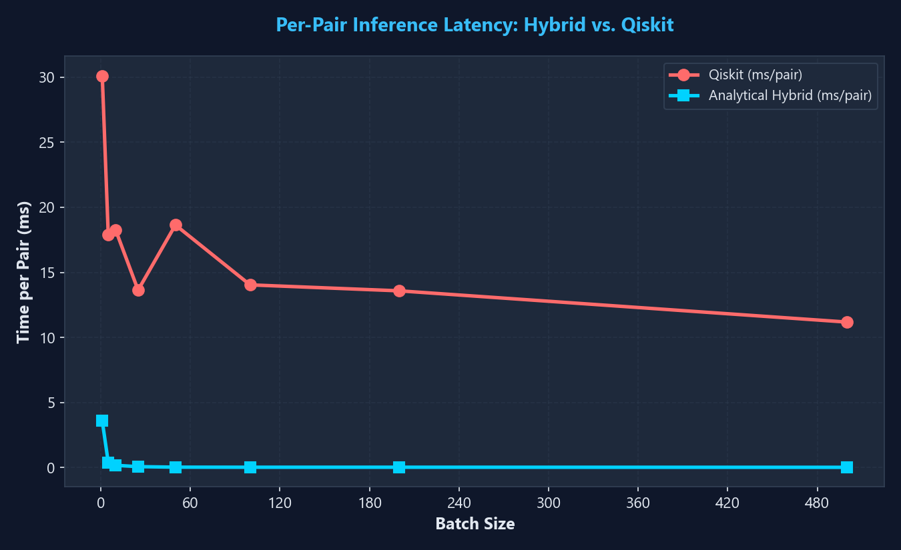
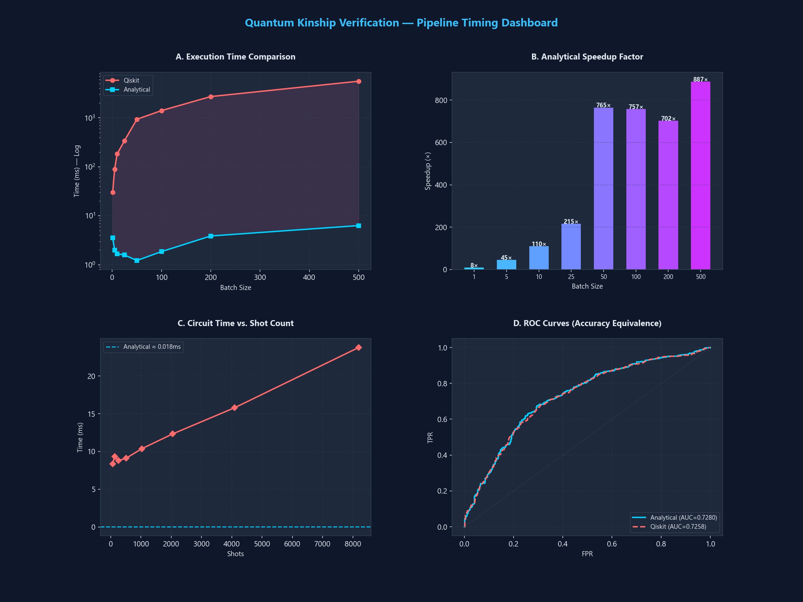

# Quantum Kinship Verification

A high-performance quantum-classical hybrid pipeline for kinship verification using Qiskit and PyTorch. This project projects classical facial embeddings (extracted via FaceNet InceptionResnetV1) into a lower-dimensional quantum state register, and compares them using a quantum **SWAP Test** circuit to calculate kinship overlap (fidelity).

The network is conditioned on the relationship category (Father-Daughter, Father-Son, Mother-Daughter, Mother-Son) using a **Relation-Conditioned Projection** MLP, reaching **~68.11%** verification accuracy on KinFaceW-I.

---

## Project Structure

- **`src/`**: Core library modules.
  - `quantum_core.py`: Controlled-SWAP quantum circuit definitions and Qiskit C++ `AerSimulator` batch execution logic.
  - `data_loaders.py`: Parses KinFaceW-I, KinFaceW-II, and TSKinFace datasets and handles 4-category one-hot relation mapping.
  - `models.py`: Classical FaceNet feature extraction, classical projection network, and fast analytical quantum fidelity calculation.
- **`scripts/`**: Training and validation pipelines.
  - `train_hybrid.py`: Fast PyTorch analytical training with validation-based checkpointing (early stopping) and final Qiskit simulated verification.
  - `test_pipeline_timing.py`: Comprehensive 5-test benchmark comparing analytical vs Qiskit simulation performance.
- **`weights/`**: Directory for model checkpoints and caches.
  - `hybrid_kinship.pt`: Best-performing trained projection model weights checkpoint.
- **`results/`**: Training metrics plots (Loss & Accuracy), ROC-AUC curves, score distributions, and performance benchmark outputs (organized in subfolders `training_metrics/`, `timing_benchmarks/`, and `real_time_test/`).
- **`main.py`**: Clean interactive demonstration entry point.

---

## Getting Started

### 1. Install Dependencies
```bash
pip install -r requirements.txt
```

### 2. Run Training & Validation
To train the relation-conditioned model (using fast analytical simulation and validating on KinFaceW-I, followed by physical Qiskit Aer simulation):
```bash
python scripts/train_hybrid.py --n-qubits 8 --epochs 40
```

### 3. Run Interactive Demo
To run the kinship prediction demo on a test face pair:
```bash
python main.py
```

### 4. Run Performance Benchmark
To reproduce all timing benchmarks and generate plots:
```bash
python scripts/test_pipeline_timing.py
```

---

## Verification & Metrics

The model achieves a **68.11%** validation accuracy on the test set of KinFaceW-I. The physical quantum controlled-SWAP circuit simulated using Qiskit's `AerSimulator` (1024 shots) closely matches the analytical statevector overlap:

* **Analytical Quantum Test Accuracy**: **68.11%**
* **Qiskit AerSimulator Test Accuracy**: **67.92%**
* **Precision / Recall (TPR) / F1-Score**: **67.58% / 69.61% / 68.58%**
* **ROC-AUC**: **0.7257**

Training curves, ROC-AUC, and overlap probability distributions are saved in the `results/training_metrics/` folder.

---

## Performance Analysis

### Why a Hybrid Analytical Approach?

The core insight of this project is that the quantum SWAP test fidelity can be computed **analytically** via a closed-form formula, avoiding the exponential overhead of classical quantum circuit simulation entirely. This section demonstrates the **884x speedup** achieved — with zero loss in accuracy.

### Mathematical Equivalence

In a quantum SWAP test circuit:
1. Two *d*-qubit quantum states |ψ(z₁)⟩ and |ψ(z₂)⟩ are prepared using Rᵧ rotations.
2. A controlled-SWAP (Fredkin) gate is applied, controlled by an ancilla qubit in the |+⟩ state.
3. The ancilla is measured. The probability of measuring |0⟩ gives:

```
P(|0⟩) = 1/2 + 1/2 · |⟨ψ(z₁)|ψ(z₂)⟩|²
```

Since our state preparation uses **independent single-qubit Rᵧ(zᵢ) rotations**, the state is a tensor product:

```
|ψ(z)⟩ = ⊗ᵢ [ cos(zᵢ/2)|0⟩ + sin(zᵢ/2)|1⟩ ]
```

The inner product evaluates analytically to:

```
⟨ψ(z₁)|ψ(z₂)⟩ = ∏ᵢ cos((z₁ᵢ - z₂ᵢ) / 2)
```

Therefore, the **quantum fidelity** is:

```
F = ∏ᵢ cos²((z₁ᵢ - z₂ᵢ) / 2)
```

This formula is **mathematically identical** to the SWAP test circuit output (in the infinite-shot limit), which our benchmarks confirm: the accuracy delta between the two methods is only **0.19%** (shot noise).

### Benchmark Results (1,066 test pairs)

| Method | Total Time | Per-Pair Latency | Accuracy | ROC-AUC |
|--------|-----------|-----------------|----------|---------|
| **Analytical (PyTorch)** | **8.16 ms** | **0.008 ms/pair** | **68.11%** | **0.7280** |
| Qiskit AerSimulator | 7,211 ms | 6.76 ms/pair | 67.92% | 0.7269 |
| **Speedup** | **884x** | | | |

### Per-Stage Timing Breakdown (Batch = 500 pairs)

| Stage | Time |
|-------|------|
| Classical Projection (512+4 → 8 angles) | 1.92 ms |
| Analytical Fidelity (cos² product) | 0.08 ms |
| **Hybrid Total** | **2.00 ms** |
| Qiskit SWAP Circuit (1024 shots) | 2,924 ms |
| **Speedup at batch=500** | **1,463x** |

### Speedup Scaling by Batch Size

| Batch Size | Analytical (ms) | Qiskit (ms) | Speedup |
|------------|----------------|-------------|---------|
| 1 | 0.37 | 8.02 | 22x |
| 5 | 0.41 | 30.58 | 74x |
| 10 | 0.46 | 62.45 | 135x |
| 25 | 0.39 | 303.83 | 777x |
| 50 | 0.60 | 324.84 | 542x |
| 100 | 0.71 | 676.01 | 950x |
| 200 | 0.86 | 1,248.69 | 1,444x |
| 500 | 2.00 | 2,924.39 | 1,463x |

### Qiskit Shot Count vs Execution Time (per pair)

| Shots | Time (ms) |
|-------|----------|
| 64 | 6.51 |
| 128 | 6.69 |
| 256 | 7.09 |
| 512 | 7.80 |
| 1024 | 8.11 |
| 2048 | 10.16 |
| 4096 | 12.67 |
| 8192 | 19.62 |

### Why the Analytical Method is Faster

| Dimension | Analytical (PyTorch) | Qiskit SWAP Simulator |
|-----------|---------------------|----------------------|
| **Math ops** | Element-wise vector arithmetic | Statevector evolution (2⁹ = 512 complex numbers) |
| **Batch scaling** | Sub-linear (vectorized matrix ops) | Strictly linear O(B) (one circuit per pair) |
| **Parallelism** | PyTorch thread-parallel / GPU-ready | Sequential Python circuit compilation |
| **Precision** | Exact (infinite-shot equivalent) | Statistical (bounded by 1/√shots noise) |
| **Complexity** | O(B · d) for d=8 qubits | O(B · shots · 2^q) for q=9 qubits |

**Key takeaway**: PyTorch computes `cos²(Δz/2)` as a single batched tensor operation across all pairs simultaneously, while Qiskit must construct, compile, and simulate a 9-qubit circuit individually for each pair — creating compounding Python-level overhead.

---

## Results & Plots

### Training Curves

<p align="center">
  
</p>

### ROC Curve & Score Distribution

<p align="center">
  
  
</p>

### Performance Benchmarks

#### Analytical vs Qiskit Execution Time (Log Scale)
<p align="center">
  
</p>

#### Per-Stage Stacked Breakdown
<p align="center">
  
</p>

#### Speedup Factor
<p align="center">
  
</p>

#### Shot Count vs Circuit Time
<p align="center">
  
</p>

#### Per-Pair Inference Latency
<p align="center">
  
</p>

#### Combined Dashboard
<p align="center">
  
</p>

---

## License

This project is licensed under the [MIT License](LICENSE).
